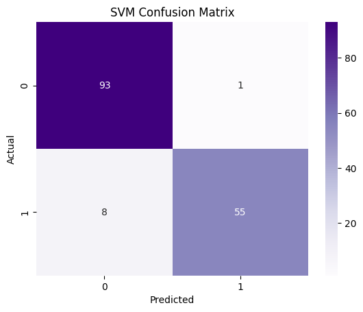

# 🔬Breast Cancer Diagnosis Classification

🔗 [LINK TO PROJECT CODE](project.ipynb)

##  Table of Contents
1. 👋🏽 [Introduction](#introduction)
2. 🎯 [Objective](#objective)
3. 🧐 [Problem Analysis: Machine Learning Requirements](#problem-analysis-machine-learning-requirements)
4. 🧑🏽‍💻 [Exploratory Data Analysis (EDA)](#exploratory-data-analysis-eda)
    1. [About the Data and Initial Data Cleaning](#about-the-data-and-initial-data-cleaning)
    2. [Data Distribution Analysis](#data-distribution-analysis)
    3. [Correlations Analysis](#correlations-analysis)
    4. [Missing Values Analysis](#missing-values-analysis)
    5. [Outlier Analysis](#outlier-analysis)
    6. [Final Data Cleaning](#final-data-cleaning)
5. 🤖 [Model Training and Evaluation](#model-training-and-evaluation)
    1. [Logistic Regression](#logistic-regression)
    2. [Decision Trees](#decision-trees)
    3. [Random Forests](#random-forests)
    4. [Support Vector Machines](#support-vector-machines)
5. ℹ️ [References](#references)

## 👋🏽 Introduction 
In this project, we will try to find, analyze, and create an unsupervised machine-learning model to solve a problem. The data we will be using will be the Breast Cancer Wisconsin (Diagnostic) Data Set, this further adds to how supervised models can assist in medical problems. 

The data, a comprehensive collection of features for each sample, was meticulously gathered from images of FNA (Fine Needle Aspiration) of breast masses at the University of Wisconsin Hospital, Madison, by Dr. William H. Wolberg. This valuable dataset is publicly available on the reputable UCI Machine Learning Repository and Kaggle [here](https://www.kaggle.com/datasets/uciml/breast-cancer-wisconsin-data). Please check the [references](#references) for more information on the dataset.

## 🎯 Objective
The goal of this project will be to classify breast cancer diagnoses as benign or malignant using the features given in the dataset. Throughout this project, we will explore Exploratory Data Analysis (EDA), data cleaning, model training and evaluation of the said model to achieve optimal classification performance. 

## 🧐 Problem Analysis: Machine Learning Requirements
Our objective leads us to believe we must use a binary classification to find what is malignant and benign. For this project, we will create multiple machine-learning models such as logistic regression, decision trees, random forests and support vector machines. 

## 🧑🏽‍💻 Exploratory Data Analysis (EDA)

### About the Data and Initial Data Cleaning
The Breast Cancer Wisconsin (Diagnostic) dataset comprises 569 entries and 33 columns. The dataset features 31 numerical columns detailing measurements such as `radius_mean`, `texture_mean`, and `area_mean`, alongside `diagnosis` (target variable) and an `id` column. Summary statistics reveal that features like `radius_mean` and `area_mean` show significant variability, indicated by their high standard deviations. The dataset contains no missing values, except for `Unnamed: 32`, which has no data and can be disregarded. Most datatypes are of float64, except for id, which is of int64 and may have to be changed to a object variable. Additionally, we must change `diagnosis` to a categorical variable of (1,0) for malignant and benign respectively.

### Data Distribution Analysis

When looking at our general observations, we notice that most of our features are right-skewed, meaning that most of the data points are concentrated on the left side, with a long tail extending to the right. However, a few features, such as `exture_mean`, `symmetry_mean`, and `fractal_dimension_mean`, appear to have a more symmetric or slightly left-skewed distribution.

Additionally, when looking at `radius_mean`, `texture_mean`, `perimeter_mean`, and area_mean (crucial for determining the size of the cell nuclei), they show a right-skewed distribution, meaning there are fewer large nuclei. 

We also find that `smoothness_mean`, `compactness_mean`, `concavity_mean`, and `concave_points_mean` (which describe the shape of the nuclei) are right-skewed. 

However when it comes to `symmetry_mean`, `fractal_dimension_mean` we find that they are more symmetrically distributed compared to the others, which shows us that there is a balacned distribution of symmetry and complexity in the cell nuclei. 

Additionally, these features are generally right-skewed, indicating variability within the measurements. 

### Correlations Analysis
We begin by analyzing the relationships between various features and the target variable `diagnosis`.

The matrix highlights that features such as `concave points_mean` (0.78), `area_mean` (0.74), `radius_mean` (0.73), and `perimeter_mean` (0.74) have strong positive correlations with the `diagnosis,` indicating that higher values of these features are associated with malignant tumours. Conversely, features such as `fractal_dimension_mean` (-0.013) and `fractal_dimension_se` (-0.0065) show very weak or negligible correlations with `diagnosis`, suggesting limited predictive value.

Additionally, features representing the "worst" values of measurements, such as `concave points_worst` (0.79), `area_worst` (0.73), and `radius_worst` (0.78), also exhibit strong correlations with the target variable, reaffirming their importance in predicting malignancy. These insights suggest that features related to the size and shape of cell nuclei, particularly those involving area and concavity measurements, are critical for distinguishing between malignant and benign breast tumours. This correlation analysis will guide feature selection and engineering in subsequent modelling steps to enhance the predictive accuracy of the classification models.

### Missing Values Analysis
The dataset contains no missing values, except for the `Unnamed: 32` column, which has no data and can be disregarded. This indicates that the dataset is complete and does not require imputation or handling of missing values.

### Outlier Analysis

The leverage versus normalized residuals squared plot identifies influential data points within the dataset. Observations like those at indices 152, 212, 38, and 297 display high leverage and large normalized residuals squared, indicating they are significant outliers. These points have extreme predictor values and substantial deviation from the fitted model, potentially exerting a disproportionate influence on the model's outcomes. The threshold for identifying outliers that we will be using is $2p/n$, where p is the number of predictors and n is the number of observations.

By identifying and managing these outliers, we can enhance the reliability and interpretability of our classification model. Additionally, our outliers are `0,   3,   9,  12,  28,  31,  38,  42,  68,  71,  78,  83,  87, 108, 112, 116, 122, 138, 152, 180, 190, 192, 202, 212, 213, 239, 252, 256, 258, 265, 288, 290, 314, 318, 352, 368, 376, 379, 400, 461, 504, 505, 528, 539, 561, 562, 567, 568`.

### Final Data Cleaning 
We have now dropped all our outliers and finally have a clean dataset to work with.

## 🤖 Model Development 
We selected Logistic Regression, Decision Trees, Random Forests, and Support Vector Machines (SVM) for this analysis due to their distinct advantages and widespread use in binary classification tasks. Logistic Regression is a fundamental model offering simplicity and interpretability, making it a solid baseline for comparison. Decision Trees provide explicit visual representations of decision-making processes, though they can be prone to overfitting. Random Forests, an ensemble method, mitigate this by aggregating multiple decision trees, enhancing stability and reducing overfitting. SVMs are powerful for handling high-dimensional data and can effectively manage non-linear decision boundaries, especially with appropriate kernel and hyperparameter tuning.

The dataset was split into 70% training and 30% test sets to ensure a robust evaluation of the models. This proportion strikes a balance between having enough data to train the models effectively and retaining a sufficient portion for unbiased performance evaluation. 

### Logistic Regression

The Logistic Regression model achieved an accuracy rate of `94.27%` when classifying breast cancer tumors as malignant or benign, demonstrating a strong performance. The confusion matrix revealed that the model accurately classified 93 out of 94 benign cases and 55 out of 63 malignant cases.

With a precision of 0.98 for predicting malignant tumors, this model is considered reliable as it identifies almost all malignant tumors correctly. It has a recall of 0.87 for malignant tumors, which means that the model identifies 87% of actual malignant cases. The model’s overall F1-score is 0.94, which reflects a balanced trade-off between precision and recall, indicating that the model is robust enough to handle the classification task.

### Decision Trees

The Decision Tree Classifier achieved an accuracy of `89.17%`, indicating solid performance in classifying breast cancer tumours. The confusion matrix shows that the model correctly identified 87 out of 94 benign cases and 53 out of 63 malignant cases. 

The precision for predicting malignant tumours is 0.88, and the recall is 0.84, suggesting that the model is moderately effective at identifying actual malignant cases but has a slightly higher rate of false negatives than Logistic Regression. The F1-score of 0.86 for malignant predictions indicates a balanced trade-off between precision and recall, though it is slightly lower than that of Logistic Regression. The weighted average F1-score of 0.89 demonstrates the model's balanced performance across both classes. 

### Random Forests

The Random Forest Classifier achieved an accuracy of `92%`, demonstrating robust performance in distinguishing between benign and malignant breast cancer tumours. The confusion matrix indicates that the model correctly classified 91 out of 94 benign cases and 54 out of 63 malignant cases. This results in a precision of 0.95 for predicting malignant tumours, highlighting the model's accuracy in identifying true positives. The recall for malignant tumours is 0.86, suggesting the model identified 86% of malignant cases. The overall F1-score for malignant predictions is 0.90, reflecting a strong balance between precision and recall. The weighted average F1-score of 0.92 indicates the model's consistent performance across both classes. The Random Forest's ensemble approach enhances stability and reduces overfitting, making it a reliable choice for this classification task.

The grid search optimized the Random Forest's hyperparameters, specifically `n_estimators,` `max_depth,` and `min_samples_split.` These parameters were chosen to explore the model's complexity and generalization capability. `n_estimators` represents the number of trees in the forest, with values 100, 200, and 300 allowing us to assess the impact of forest size on performance. `max_depth` controls the maximum depth of each tree, with options 10, 20, and None, helping to balance model complexity and overfitting. `min_samples_split`, set at 2, 5, and 10, determines the minimum number of samples required to split an internal node, influencing the model's sensitivity to variance and overfitting. This thorough grid search ensures the selection of optimal parameters, enhancing the model's predictive accuracy and robustness.

### Support Vector Machines (SVM)

The Support Vector Machine (SVM) achieved an accuracy of `94%`, indicating strong performance in classifying breast cancer tumours. The confusion matrix shows that the model correctly classified 93 out of 94 benign cases and 55 out of 63 malignant cases, resulting in a high precision of 0.98 for malignant tumour predictions. The recall for malignant tumours is 0.87, suggesting that the model successfully identified 87% of malignant cases. The F1-score for malignant predictions is 0.92, reflecting a well-balanced trade-off between precision and recall. The overall weighted average F1-score of 0.94 underscores the model's effectiveness in maintaining high accuracy across both classes. The SVM's ability to handle high-dimensional data and its robustness against overfitting make it an excellent choice for this classification task.

The grid search for SVM involved optimizing hyperparameters `C,` `gamma,` and `kernel` to enhance model performance. The parameter grid included `C` values of 0.1, 1, and 10 to explore different regularization strengths, impacting the model's generalization ability. `Gamma` values of 1, 0.1, and 0.01 were chosen to examine the influence on the decision boundary's curvature, with lower values leading to smoother boundaries. The `rbf` (Radial Basis Function) kernel was selected for its effectiveness in handling non-linear relationships in the data. Scaling the training and testing data ensures that all features contribute equally to the model, preventing features with larger scales from dominating the learning process. This is crucial for SVM performance due to its reliance on distance calculations.

## ℹ️ References: 
UCI Machine Learning & Collaborator. (2015). Breast Cancer Wisconsin (Diagnostic) Data Set. Kaggle. Retrieved [2024], from https://www.kaggle.com/datasets/uciml/breast-cancer-wisconsin-data

Wolberg, W., Mangasarian, O., Street, N., & Street, W. (1995). Breast Cancer Wisconsin (Diagnostic) [Data set]. UCI Machine Learning Repository. https://doi.org/10.24432/C5DW2B 

----------------------------------------------------------------------------------------------------------------------------

© Karan D 2024